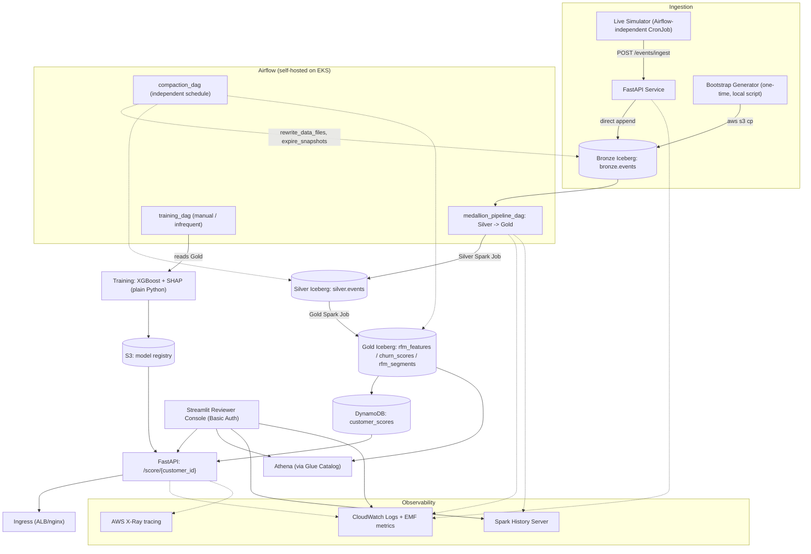

# Architecture Overview

## Objective

Predict customer churn from raw mobile-engagement events to drive campaign audience selection (win-back push targeting), deployed as an actually-reachable production service on AWS — not a notebook experiment.

## System diagram

## Component index

| Doc | Covers |
|---|---|
| [01-data-platform.md](01-data-platform.md) | Medallion layers (Bronze/Silver/Gold), Iceberg format, Glue Catalog, Athena, Spark-on-K8s, feature/label definitions, baseline, compaction |
| [02-simulator.md](02-simulator.md) | Bootstrap generator, live trickle simulator, ingest path, customer registry |
| [03-orchestration.md](03-orchestration.md) | Self-hosted Airflow on EKS, DAGs, scheduling, dependency chaining |
| [04-serving.md](04-serving.md) | Real-time API, DynamoDB serving-layer split, ingress/auth/rate-limiting |
| [05-observability.md](05-observability.md) | CloudWatch logs/EMF metrics, X-Ray, dashboards, alarms, Spark History Server |
| [06-reviewer-console.md](06-reviewer-console.md) | Streamlit console, Basic Auth, live lookup, evidence capture |
| [../modeling.md](../modeling.md) | Model choice (XGBoost), training approach, synthetic data generation assumptions |
| [../evaluation.md](../evaluation.md) | Metrics, threshold selection, evaluation protocol |

## Deployment target

Personal AWS sandbox account first (`ap-south-1`, new-account credit), Terraform re-applied unchanged to the official Localytics AWS interview account once that invite arrives — timeline noted honestly in the final submission.

## Design principle running through every component

Right tool per stage, not one technology applied everywhere by default: Spark for genuine DataFrame-scale transforms (Silver/Gold/Compaction), plain Python for training (dataset is ~1,200 rows — distributing that would be cargo-culting), DynamoDB for low-latency point lookups vs. Athena for analytical/ad-hoc queries, CronJobs/Jobs (pay-per-run) instead of always-on compute wherever batch suffices, given the shared account's strict budget constraint.
