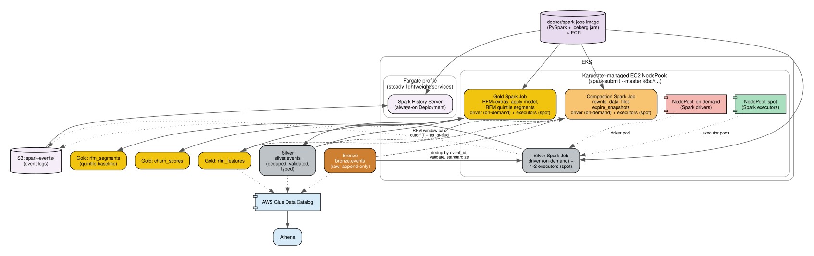

# Data Platform — Medallion Architecture, Iceberg, Spark-on-K8s

## Why medallion + Iceberg

Raw events arrive continuously (bootstrap history + live trickle) and need progressively cleaner, more aggregated representations before they're usable for scoring or dashboards. Medallion layering (Bronze -> Silver -> Gold) gives each stage a single clear responsibility, and Apache Iceberg gives us schema evolution, ACID merges, and time travel on top of plain S3/Parquet — all cheap (Glue Catalog costs are negligible at this scale) and standard for a modern lakehouse.

## Layers

### Bronze — `s3://<data-lake-bucket>/bronze/`
Raw landed events, append-only, one row per event exactly as received. **Not an Iceberg table** — deliberately plain, partitioned JSON files (`bronze/live/date=.../hour=.../batch-*.json`), since Bronze here is a write-once, read-once raw landing zone with a single consumer (Silver); Iceberg's ACID-merge/schema-evolution value only starts paying for itself from Silver onward, where multiple runs genuinely need to update the same rows in place. Written directly by:
- The bootstrap generator (one-time historical load, `aws s3 cp` of the full synthetic dataset)
- The `/events/ingest` API endpoint (live trickle, `src/service/app.py`) — one real S3 object per batch, no Spark needed for a simple append, keeps ingest latency low. This is exactly what the S3 -> SNS -> SQS -> Lambda chain below watches (`filter_prefix = "bronze/"`) to auto-trigger `medallion_pipeline_dag`.

No transformation happens here beyond schema enforcement — Bronze is a faithful copy of what arrived.

### Silver — `silver.events` (Spark job)
Cleaned, deduplicated, validated, schema-conformed:
- Dedup by `event_id` (the live trickle or a retried ingest could produce duplicates)
- Validate `event_type` against the known enum (session, purchase, push_sent, push_open, campaign_click, in_app_event, support_ticket); drop/quarantine anything else
- Standardize timestamp to UTC, parse `properties` into typed columns per event_type rather than a loose JSON blob
- Runs as a Spark job (`spark-submit --master k8s://...`), triggered by the Airflow `medallion_pipeline_dag` after Bronze has new data

### Gold — `rfm_features`, `churn_scores`, `rfm_segments` (Spark job)
Business-level, customer-grained tables:

**Two distinct modes, one function** (`compute_rfm_features`, `src/features/rfm.py`):
- **Offline train/eval** (the default): features use Silver events with `timestamp <= T`, where `T = as_of − 60 days` — the leakage-safe cutoff below, reserving the following 60 days as the label window so features and label never overlap. This is what `scripts/run_training_pipeline.py` uses.
- **Live scoring** (`medallion_pipeline_dag`'s real, deployed `gold_transform` — `--live-scoring`, `--as-of` omitted so it defaults to `now()`): `T = as_of` itself — every event known right now, no reserved gap. There's no label to protect against leakage from at serving time, so holding back the most recent 60 days would just mean scoring on stale data, defeating the point of a live pipeline.

**`gold.rfm_features`** — one row per customer per scoring run, computed only from Silver events with `timestamp <= T`:

| Feature | Definition |
|---|---|
| `recency_days` | Days between T and the customer's last `session` before T |
| `frequency_30d` | Count of `session` events in (T−30d, T] |
| `frequency_90d` | Count of `session` events in (T−90d, T] |
| `purchase_count_90d` | Count of `purchase` events in (T−90d, T] |
| `purchase_revenue_90d` | Sum of `amount_usd` in (T−90d, T] |
| `lifetime_revenue` | Sum of all `purchase` amounts before T (monetary sparsity backup — most 90d windows are zero) |
| `has_ever_purchased` | Boolean, before T |
| `push_open_rate` | Lifetime `push_open` / `push_sent` before T (0 if never sent) |
| `campaign_click_count_90d` | Count of `campaign_click` in (T−90d, T] |
| `support_ticket_count_90d` | Count of `support_ticket` in (T−90d, T] |
| `avg_session_duration_90d` | Mean `duration_sec` of sessions in (T−90d, T] |
| `add_to_cart_count_90d` * | Count of `in_app_event` where `event_name = add_to_cart`, (T−90d, T] |
| `feature_use_count_90d` * | Count of `in_app_event` where `event_name = feature_use`, (T−90d, T] |

\* provisional — confirmed or dropped via SHAP/ablation once the model is trained on the synthetic-scale dataset (the raw 80-row sample was too noisy to decide this from correlation alone).

**Label** (computed alongside, not part of the feature vector): `churn = 1` if no `session` event in (T, as_of] — strictly after the feature cutoff, so features and label never see overlapping data.

**`gold.rfm_segments`** — the classic 1-5 quintile RFM scoring (R, F, M each scored 1-5, boundaries frozen from the training population and reused at serving time so a customer's segment doesn't drift just because the population changed), combined into segments (Champions / Loyal / At Risk / Hibernating / Lost, MoEngage-style). This is NOT a model input and NOT where the label comes from (that would be circular) — it's the required baseline heuristic ("bottom 2 segments = predicted churn") and a stakeholder-facing dashboard artifact, queryable directly via Athena.

**`gold.churn_scores`** — the trained XGBoost model's probability output per customer, written after the training/scoring step, plus a copy pushed to DynamoDB (`customer_scores`) for low-latency serving — see [04-serving.md](04-serving.md).

**History retention (important)**: `rfm_features`, `rfm_segments`, and `churn_scores` are **append-only, partitioned by `run_date`** — not overwritten each run. DynamoDB's `customer_scores` holds only the latest snapshot (all the real-time API needs), but the Iceberg tables keep every run's history, which is what powers segment-migration and trend analysis — see [07-analytics.md](07-analytics.md).

## Spark-on-Kubernetes

Self-managed (not AWS Glue) — a deliberate choice to demonstrate direct platform engineering capability, accepted alongside the added 4-day-timeline/budget risk, with these mitigations:
- **Spark Operator installed** (controller + `SparkApplication`/`ScheduledSparkApplication` CRDs + admission webhook) — chosen over plain `spark-submit` for declarative, GitOps-friendly job specs and built-in status/retry/history (`kubectl get sparkapplications` is a real, live artifact for reviewers). See [03-orchestration.md](03-orchestration.md) for exactly how each CRD is used.
- **Karpenter-managed EC2 NodePools**, not Fargate, for Spark workloads specifically — because the driver/executor on-demand-vs-spot split isn't possible on Fargate:
  - **On-demand NodePool**: Spark **drivers** — losing a driver kills the whole job, so it needs stable capacity.
  - **Spot NodePool**: Spark **executors** — Spark natively retries lost tasks on executor preemption, so spot's interruption risk is cheap to absorb, and spot pricing meaningfully cuts cost for a workload that's bursty by nature (only running when triggered).
  - Karpenter provisions right-sized nodes just-in-time for pending pods and deprovisions them when idle, avoiding a static, always-paid-for node group for workloads that only run in short bursts.
- Fargate remains the target for the *steady, lightweight* services (scoring/ingest API, Streamlit console, Spark History Server) — no driver/executor split needed there, so Fargate's simplicity still wins.
- Driver + 1-2 executor pods, resource requests sized to actual data volume (a few thousand rows), not hypothetical big-data scale.
- Runs as `SparkApplication`/`ScheduledSparkApplication` CRs (triggered by Airflow or the Operator's own cron), not an always-on cluster — pay only for actual run duration.
- Docker image: `docker/spark-jobs/` — PySpark + Iceberg runtime jars + our Silver/Gold/Compaction code, one image, entrypoint selected by job arguments, pushed to ECR.

## Local[*] validation before this ever touches a cluster

Per the execution plan, `src/spark_jobs/{silver_transform,gold_transform,compaction}.py` were validated in local PySpark mode (`tests/test_spark_jobs.py`) against real synthetic data before any Terraform/K8s work — proving the dedup/validation/aggregation logic correct while it's still cheap to debug. This caught a real, subtle bug: Spark's session timezone defaults to the JVM's local timezone, not UTC, so `toPandas()` was silently shifting every timestamp by the local UTC offset relative to pandas' UTC-aware values (a ~5.5 hour drift on this dev machine, consistent with IST). Fixed by explicitly setting `spark.sql.session.timeZone = "UTC"` — exactly the kind of correctness bug that's far cheaper to catch locally than after a cluster is involved.

Gold's design choice — convert Silver's (Spark-scale) output to pandas via `toPandas()` and reuse the already-tested `src/features/rfm.py` functions rather than reimplementing the RFM window logic natively in PySpark — is validated by an exact-match test: the Spark path and the pure-pandas path must produce identical output for the same input, which is what justifies not maintaining two parallel implementations of the same business logic.

**A second real bug caught by actually building and running the Docker image** (not just local[*] tests against the venv's newer library versions): PySpark 3.4.0's `toPandas()` internally calls `.astype("datetime64")` with no unit, which pandas ≥2.0 rejects outright (`TypeError: Casting to unit-less dtype 'datetime64' is not supported`) — a genuine PySpark/pandas version incompatibility, not a hypothetical one. Fixed by pinning `pandas<2.0` in `docker/spark-jobs/requirements.txt`, which in turn required pinning `numpy<2.0` too (pandas 1.5.3's compiled extensions are ABI-incompatible with numpy 2.x: `ValueError: numpy.dtype size changed, may indicate binary incompatibility`). Verified end-to-end against the real containerized image (not just unit tests): Silver and Gold both ran via actual `spark-submit` inside the built image, producing 1,200 real Parquet rows with the correct 14-column schema.

## Compaction

The live trickle simulator firing every ~10 minutes creates many small files in Bronze/Silver/Gold Iceberg tables — genuine small-file bloat, not a hypothetical concern. A separate Spark job runs Iceberg's maintenance procedures: `rewrite_data_files` (compact small files) and `expire_snapshots` (control metadata/storage growth over time). This one is a **`ScheduledSparkApplication`** CR (native Spark Operator cron, e.g. hourly) rather than an Airflow DAG — it's genuinely just "run on a timer, no dependencies," so it doesn't need Airflow's orchestration on top. Same `spark-jobs` Docker image, different entrypoint argument.

## Catalog and querying

**AWS Glue Data Catalog** holds the Iceberg table metadata for bronze/silver/gold. **Athena** queries all three layers directly — used by the reviewer console for dashboards and by marketing (in the real production scenario) for ad-hoc audience pulls (e.g. "give me everyone in the Hibernating segment"), independent of the real-time scoring API.
