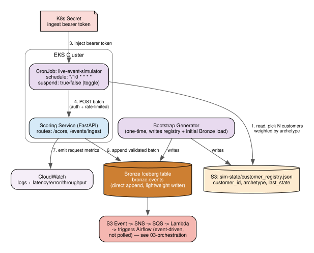

# Live Simulator



## Purpose

A static one-time synthetic file doesn't demo well — reviewers would just see a frozen CSV. The live simulator makes the end-to-end pipeline demonstrably real: new events show up, flow through ingest, get processed, and update scores, all while a reviewer watches.

## Two generators, two jobs

### 1. Bootstrap generator (one-time, run locally before anything else)
Generates the full ~1,200-customer historical dataset (2 years of backdated events per our archetype design — see [../modeling.md](../modeling.md)), writes it as the initial Bronze Iceberg load, and writes `S3: sim-state/customer_registry.json` (customer_id + assigned archetype for all ~1,200 customers) so the live simulator has a consistent population to keep generating events for.

### 2. Live trickle generator (recurring, in-cluster CronJob)
Runs every ~10 minutes (`*/10 * * * *`), and each run:
1. Reads the customer registry from S3.
2. Picks 5-20 customers, weighted by their archetype's activity rate (high-engagement customers show up more often).
3. Generates 1-3 new events per selected customer, using the same fitted distributions as the bootstrap generator, **timestamped to current wall-clock time** (not backdated) — this is what makes it feel live.
4. POSTs the batch to the `/events/ingest` API endpoint, authenticated with a bearer token stored in a Kubernetes Secret.

## Ingest path

`/events/ingest` (on the same FastAPI service as scoring) validates the request's auth token and payload schema, applies a rate limit, then appends the batch directly into the **Bronze Iceberg table** via a lightweight Python Iceberg writer — no Spark needed for a simple append.

That write creates a new S3 data file, which is what feeds the event-driven processing trigger (S3 Event Notification -> SNS -> SQS -> Lambda -> Airflow) described in [03-orchestration.md](03-orchestration.md) — the simulator doesn't need to know or care how downstream processing gets kicked off.

## Toggle

The CronJob's native `suspend` field turns the live trickle on/off instantly, no redeploy:
```
kubectl patch cronjob live-event-simulator -p '{"spec":{"suspend":true}}'   # pause
kubectl patch cronjob live-event-simulator -p '{"spec":{"suspend":false}}'  # resume
```
Useful for a controlled live moment on a reviewer call — pause it beforehand, then resume it live so the reviewer watches new data flow through the whole system in real time.
