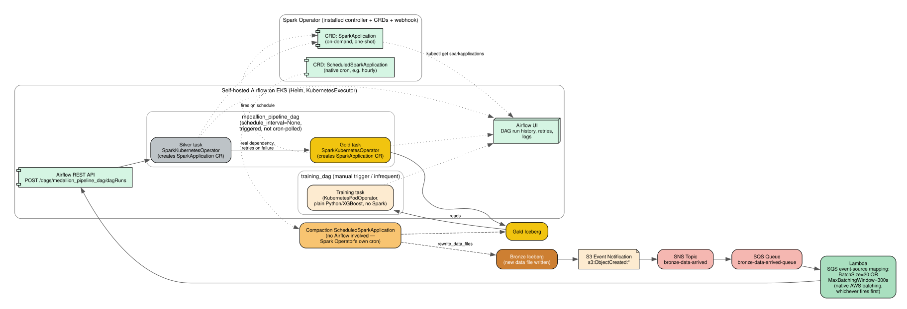

# Orchestration — Event-Driven Triggering + Airflow

## Why not a fixed cron schedule

Running the Silver/Gold pipeline on a blind fixed interval means either wasting compute on empty runs (nothing new arrived) or missing bursts (trickle rate varies). Instead, processing is **triggered by actual data arrival**, with a time-based safety net so data never sits unprocessed indefinitely.

## Trigger chain: S3 -> SNS -> SQS -> Lambda -> Airflow

1. Every new event batch written to Bronze (from the live simulator via `/events/ingest`, or the bootstrap load) creates a new S3 data file.
2. An **S3 Event Notification** (`s3:ObjectCreated:*`) on that path publishes to an **SNS topic** (`bronze-data-arrived`).
3. SNS fans out to an **SQS queue** (`bronze-data-arrived-queue`) — durable, poll-based, decoupled from the producer.
4. A **Lambda function** is wired to the queue via an **SQS event-source mapping** configured with `BatchSize=20` and `MaximumBatchingWindowInSeconds=300` — AWS's native batching semantics, no custom polling loop needed. Lambda fires when EITHER 20 messages have accumulated OR 5 minutes have passed, whichever comes first.
5. On invocation, the Lambda calls the **Airflow REST API** (`POST /dags/medallion_pipeline_dag/dagRuns`) to trigger a pipeline run. `medallion_pipeline_dag` has `schedule_interval=None` — it only ever runs when triggered, never polled on a timer.

This gives us: prompt processing when there's a real burst of activity, no wasted runs during quiet periods, and a guaranteed maximum staleness (5 minutes) even during a slow trickle.

This full chain is genuinely deployed (`infra/terraform/modules/messaging`) and, as of `src/service/app.py` actually writing real Bronze objects (previously a local-file stand-in — see `SUBMISSION.md`), verified firing end-to-end from a live `/events/ingest` call through to a `medallion_pipeline_dag` run triggered with zero manual intervention.

A second real bug surfaced the first time this Lambda was ever actually invoked (it had never fired before, since Bronze never got real writes): it sent `Authorization: Bearer <token>`, but Airflow's REST API auth backend defaults to `session` (cookie-based) — a bearer token can never satisfy that, regardless of its value. Fixed by enabling `basic_auth` alongside `session` on the webserver and switching the Lambda to send real Basic-scheme credentials for the chart's own stock `admin`/`admin` user.

## Spark Operator CRDs

We installed the **Spark Operator** (a separate controller + CRDs + admission webhook) rather than using plain `spark-submit`, for declarative job specs and built-in status/retry/history:

- **`SparkApplication`** — on-demand, one-shot job. Used for **Silver** and **Gold**, submitted via Airflow's `SparkKubernetesOperator` task, which creates the `SparkApplication` custom resource and lets the Operator's controller handle actually running it. `kubectl get sparkapplications` shows real, live job status — a concrete artifact for reviewers, not just a diagram.
- **`ScheduledSparkApplication`** — the Operator's own native cron scheduling, wrapping a `SparkApplication` template with a `schedule` field. Used for **Compaction**, which is genuinely just "run on a timer, no dependencies" — it doesn't need Airflow's DAG machinery on top, so it runs independently via the Operator's own scheduler.

## Airflow

**Self-hosted on EKS** (Helm chart, `KubernetesExecutor`) rather than managed MWAA — consistent with the same capability-demonstration choice made for Spark, accepted alongside the added setup/ops time within the 4-day window.

**Deliberately minimal/lite configuration** — a single scheduler pod, a lightweight Postgres backend (no HA, no read replicas, sized for a demo not production scale), no worker autoscaling. This directly addresses the setup-time/ops-risk a full production-grade Airflow install would carry, while keeping the real DAG-dependency-chaining/retry/UI story intact.

**Live-demo safety net**: Airflow's UI has a native **"Trigger DAG"** button — if the automated event-driven chain (S3 -> SNS -> SQS -> Lambda) has any hiccup during a live reviewer call, triggering `medallion_pipeline_dag` manually from the UI guarantees the pipeline still runs, with zero extra code needed to build that fallback.

- **`medallion_pipeline_dag`**: `Silver task -> Gold task`, real dependency chaining (Gold only runs if Silver succeeded) and automatic retries — not a timer-based guess at sequencing.
- **`training_dag`**: real `@daily` schedule (also manually triggerable), `KubernetesPodOperator` running plain Python/XGBoost (not Spark — see [../modeling.md](../modeling.md) for why). Deliberately decoupled from the main pipeline's cadence: **train on a schedule, score continuously** is itself a production-readiness talking point. Each run pushes its trained artifacts to the S3 model registry (`scripts/run_training_pipeline.py`, `MODEL_REGISTRY_BUCKET`), which is exactly what `gold_transform`'s `sync-model-artifacts` initContainer reads before every scoring run — so a retrain genuinely changes what the next Gold run scores customers with, not just a local artifact nobody reads.

  **The training set itself is real and live-accumulating**, not a regenerated fixed synthetic snapshot: with `DATA_LAKE_BUCKET` set, this reads the actual Silver Iceberg table's plain-Parquet output — the same data lineage `gold_transform` scores from — which includes the synthetic bootstrap population, the real 80-customer sample, and whatever `live_simulator_dag` has trickled in since. Whether that translates into a *different* model each day depends on `select_as_of` (`src/modeling/train.py`): it tries `as_of=now()` first and only adopts it if the resulting label balance falls in a tight band anchored to this system's validated ~27% base rate; otherwise it falls back to the original bootstrap's historical cutoff. That band is tight on purpose — live-tested against real data, a looser one accepted a candidate whose aggregate rate looked fine but was actually signal-diluted (`live_simulator_dag` samples customers uniformly by population share, not by engagement propensity, so "touched recently" doesn't yet discriminate genuine churn the way the original archetype-driven label does). `reports/training_diagnostics.json`, pushed to the model registry alongside the model, records exactly which `as_of` was used on any given run and why — so the transition to genuinely-live training happens automatically the day real traffic quality supports it, with no silent regression and no manual cutover.
- **`analytics_dag`**: daily, time-based schedule (not event-triggered like `medallion_pipeline_dag`) — KPI trends and cohort retention don't need low-latency refresh, and shouldn't couple to or slow down the churn-scoring critical path. See [07-analytics.md](07-analytics.md).
- **`live_simulator_dag`**: the live trickle generator (see [02-simulator.md](02-simulator.md)), running as an Airflow DAG rather than a raw Kubernetes CronJob specifically so it shares the same start/pause control plane as everything else — Airflow's native per-DAG pause/unpause toggle, flippable live during a reviewer demo with no `kubectl` needed.
- **Airflow UI**: DAG run history, retries, logs — linked from the reviewer console.
