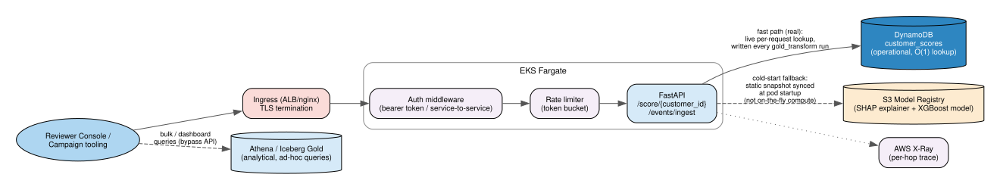

# Serving — Real-Time API + Operational/Analytical Split

## Current implementation status (read this before the design below)

The design below (DynamoDB fast path + on-the-fly cold-start compute) is the
**target**, and the DynamoDB table + IRSA grants for it are genuinely
provisioned (`infra/terraform/modules/storage/main.tf`,
`modules/irsa/main.tf`). The **deployed** `src/service/app.py` does not read
from DynamoDB yet — it serves `/score/{customer_id}` from a static JSON
snapshot (`models/customer_scores.json`) synced from the S3 model registry
at pod startup. That snapshot is refreshed from the real Gold Spark job's
output (all customers scored in the last Gold run, not just the training-time
sample), but it is a point-in-time file, not a live per-request DynamoDB
lookup — and there is no cold-start fallback in the request path: a
`customer_id` with no row in that snapshot returns a plain `404`, not an
on-the-fly computed score. See `SUBMISSION.md` at the repo root for why, and
for what wiring this up for real would take. Sections below describe the
target design as originally specified.

## Two stores, two purposes

A standard, deliberate pattern rather than one store trying to do both jobs:

- **Athena / Iceberg Gold tables** — the **analytical** layer. Ad-hoc marketing queries ("give me everyone in the Hibernating segment"), dashboards, the reviewer console's aggregate views. Query latency of 1-2+ seconds is fine here.
- **DynamoDB `customer_scores`** (keyed by `customer_id`, written by the Gold Spark job after each run) — the **operational** layer. Fast, O(1) point lookups for the real-time API. Querying Athena per API request would be far too slow for live scoring.

## `/score/{customer_id}`

1. Request hits the ingress (TLS termination) -> auth middleware -> rate limiter -> FastAPI.
2. **Fast path**: look up the latest precomputed score in DynamoDB (written by the last Gold job run).
3. **Cold path** (customer not yet in DynamoDB — e.g. brand new): compute on-the-fly from the latest available Silver data + the model artifact loaded from the S3 model registry.
4. Response includes the probability, the RFM segment, and (for the console) a SHAP-based explanation — see [../modeling.md](../modeling.md).

## `/events/ingest`

Same service, different route — see [02-simulator.md](02-simulator.md) for what calls it and [03-orchestration.md](03-orchestration.md) for what happens after it writes to Bronze.

## Auth, rate limiting, tracing

- **Auth**: bearer token validated at the API layer; the live simulator's token lives in a Kubernetes Secret, injected as an env var — this is our service-to-service auth story.
- **Rate limiting**: a token-bucket limiter in front of both routes, protecting against a runaway simulator misconfiguration or an abusive caller.
- **Tracing**: AWS X-Ray end-to-end (ingress -> API -> DynamoDB/S3 -> response) — a real per-hop latency breakdown, not just an aggregate number. See [05-observability.md](05-observability.md).

## Ingress

ALB or nginx ingress (Terraform-managed), fronting both the scoring/ingest API and the Streamlit reviewer console (separate route, separate auth — see [06-reviewer-console.md](06-reviewer-console.md)) — this is the concrete answer to the assignment's "how does this integrate with the platform's existing ingress/gateway stack" requirement.
