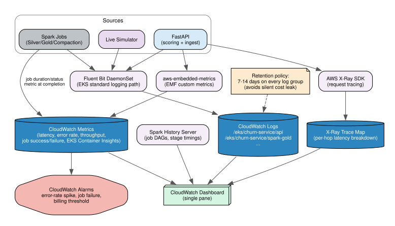

# Observability

This is the direct answer to the assignment's production-readiness ask: "how do you expose observability metrics (latency, error rate) back to the centralized platform dashboard."

## Logging

Every component (API, Spark jobs, live simulator) ships stdout to **CloudWatch Logs** via the standard EKS logging path (Fluent Bit DaemonSet), one log group per component (`/eks/churn-service/api`, `/eks/churn-service/spark-gold`, etc.) — queryable via CloudWatch Logs Insights when something fails.

## Metrics

- **Custom app metrics** via **CloudWatch EMF** (Embedded Metric Format), using the `aws-embedded-metrics` Python library in the FastAPI service — request latency/error rate/throughput on `/score` and `/events/ingest`, logged as structured JSON that CloudWatch automatically extracts into real metrics. No Prometheus/Grafana stack needed.
- **Spark job metrics** — success/failure and duration emitted as a metric at job completion.
- **EKS Container Insights** — pod CPU/memory/restarts across the cluster.

## Tracing

**AWS X-Ray**, end-to-end (ingress -> API -> DynamoDB/S3 -> response) — a real per-hop latency breakdown for a given request, not just an aggregate number.

## Dashboard — organized around the assignment's own 4 production-readiness pillars

Rather than one undifferentiated wall of metrics, the CloudWatch Dashboard has four named panel groups, each answering one specific question from the assignment's production-readiness section:

| Panel group | Answers | Metrics |
|---|---|---|
| **Auth** | Is the service-to-service auth actually working, and is anyone trying to break it? | Successful vs. failed auth attempts (401/403 rate) on `/score` and `/events/ingest`, broken out by caller (simulator vs. console vs. other) |
| **Rate limiting** | Is the limiter doing its job, and against whom? | Requests allowed vs. throttled (429 rate) per route, top offending callers |
| **Observability (latency/errors)** | Is the service healthy right now? | P50/P90/P99 latency, error rate, throughput on `/score` and `/events/ingest` (via EMF), plus X-Ray trace map |
| **Failure modes** | When something breaks, what actually broke, and did we degrade gracefully? | DynamoDB throttle/error rate, S3 read/write errors, model-load failures triggering the cold-path fallback, Spark job failure count (from Airflow/SparkApplication status), Spark job success/failure + duration, EKS Container Insights (pod restarts/OOMs) |

This structure is deliberate: it means the dashboard itself is direct evidence for the "how does this handle auth/rate limiting/observability/failure modes" question, not just a claim in the write-up. Linked from the reviewer console.

## Alarms

CloudWatch Alarms on API error-rate spikes and Spark job failures, alongside the billing alarm already set on the AWS account — ties to the "operate this at 3am" mindset the assignment explicitly asks about, not just an unwatched dashboard.

## Spark History Server

Every Spark job runs with `spark.eventLog.enabled=true`, writing event logs to `s3://<bucket>/spark-events/`. A small always-on Deployment (Fargate) serves the History Server UI behind the ingress — reviewers can browse real job DAGs, stage timings, and executor metrics live, not just take the architecture diagram's word for it.

## Cost gotcha we deliberately avoid

CloudWatch Log Groups default to **never-expire retention** — on a strict-budget shared account, that's a silent, easy-to-miss cost leak. Terraform sets explicit 7-14 day retention on every log group we create.
