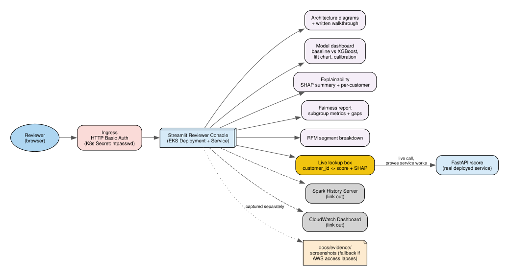

# Reviewer Console

## Purpose

A single, consolidated, password-protected page tying the entire submission together, so a Localytics reviewer doesn't have to piece the story together from separate tools, screenshots, and this documentation.

## Content

- **Architecture diagrams** (the ones in this `docs/architecture/` folder) with a written walkthrough per layer.
- **Model dashboard**: baseline (RFM quintile rule) vs. XGBoost metrics side-by-side, the lift/cumulative-gains chart, calibration — see [../evaluation.md](../evaluation.md).
- **Explainability**: SHAP summary plot + example per-customer explanations in plain language — see [../modeling.md](../modeling.md).
- **Fairness report**: subgroup metrics, gaps found, recommendations.
- **RFM segment breakdown** (Champions / Loyal / At Risk / Hibernating / Lost).
- **Analytics tab**: business KPI trends, RFM segment migration, and cohort retention charts, fed by the separate daily analytics pipeline — see [07-analytics.md](07-analytics.md).
- **Live lookup box**: enter a `customer_id`, calls the real `/score` API, shows the churn probability + its SHAP explanation live — this is what proves the deployed service actually works, not a static screenshot.
- Links out to the **Spark History Server** and the **CloudWatch Dashboard** for anyone who wants to go deeper.

## Tech

**Streamlit** — fast to build tables/charts/interactive lookups in Python, so build time goes into the analysis rather than frontend engineering. Runs as another small Deployment+Service on the same EKS cluster (Fargate), its own ingress route.

## Auth

**HTTP Basic Auth at the ingress level** (an nginx/ALB ingress annotation + a Kubernetes Secret holding the credentials) — appropriate for a small, short-lived reviewer audience. No full login system or Cognito user pool needed. Credentials are shared with Localytics separately (in the submission notes), never committed to this repo.

## Risk: AWS access lapses after 4 days

The console link may go dark before anyone reviews it. Mitigation: screenshots of the console itself are captured into `docs/evidence/` in this repo — the same reasoning as the assignment README's own "capture evidence in case account access has expired" instruction.
