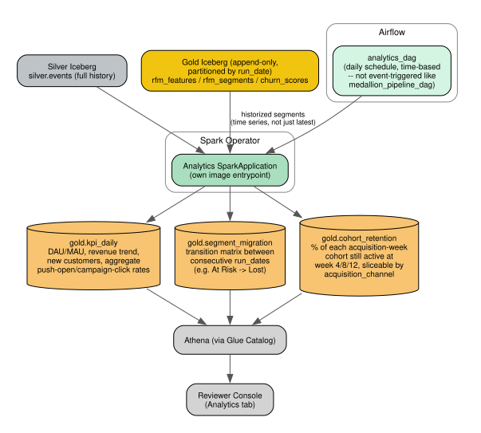

# Analytics Pipeline

## Purpose

Distinct from the per-customer RFM/churn-score pipeline (which answers "should we target this customer"), this pipeline answers the business-trend questions a product/marketing stakeholder would actually ask on a dashboard: is engagement growing or shrinking, how is revenue trending, are customers moving toward or away from risk segments over time, and how does retention look by acquisition cohort.

## Prerequisite: Gold tables must retain history

The RFM/churn Gold tables (`rfm_features`, `rfm_segments`, `churn_scores` — see [01-data-platform.md](01-data-platform.md)) are **append-only, partitioned by `run_date`**, not overwritten on each pipeline run. This was previously unstated and needed to be made explicit: DynamoDB's `customer_scores` table holds only the *latest* snapshot (that's all the real-time API needs), but the Iceberg Gold tables keep every run's snapshot — cheap on S3, and Iceberg handles it natively. Without this, segment-migration and trend analysis would have nothing to compare across time.

## Why a separate job, not folded into Gold

The churn-scoring Gold job runs on the event-driven trigger (new data arrives -> process promptly, see [03-orchestration.md](03-orchestration.md)) — that cadence is about keeping campaign targeting fresh. Analytics trends don't need that latency; a **daily, time-based schedule** is the right cadence and shouldn't couple to (or slow down) the churn-scoring critical path. It's its own `SparkApplication`, its own `analytics_dag` in Airflow, same `spark-jobs` Docker image with a different entrypoint.

## Output tables

**`gold.kpi_daily`** — one row per day: DAU, WAU/MAU, total/average revenue, new customers, aggregate push-open rate, aggregate campaign-click rate. The general "is the business healthy" trend view.

**`gold.segment_migration`** — a transition matrix between consecutive `run_date`s: how many customers moved from each RFM segment to each other segment (e.g. `At Risk -> Lost`, `Champions -> Loyal`) between runs. This is what makes the RFM segmentation (see [modeling.md](modeling.md)) genuinely useful as a *monitoring* tool, not just a point-in-time label — a marketer can see the "Lost" segment growing week over week before it shows up in aggregate churn numbers.

**`gold.cohort_retention`** — for each acquisition-week cohort (based on a customer's first-ever event date), the percentage still active (had a session) at 4/8/12 weeks post-acquisition. Sliceable by `acquisition_channel` — reuses the same synthetic segment field from the fairness check ([fairness.md](fairness.md)), giving a second, complementary lens on the same synthetic assumption (e.g. "does retention differ by acquisition channel," alongside "does model accuracy differ by acquisition channel").

## Consumption

Real, not a mockup: the console's Analytics tab calls two API endpoints (`/analytics/kpi_daily`, `/analytics/segments`) that run live Athena queries against these Iceberg tables and render the results as actual time-series/bar charts — distinct from the console's per-customer lookup and model-metrics sections (see [06-reviewer-console.md](06-reviewer-console.md)). Currently only `kpi_daily` and the RFM segment bucketing (`rfm_segments`) are wired up this way; `segment_migration` and `cohort_retention` aren't implemented yet (see this doc's "Output tables" section and `SUBMISSION.md`).
