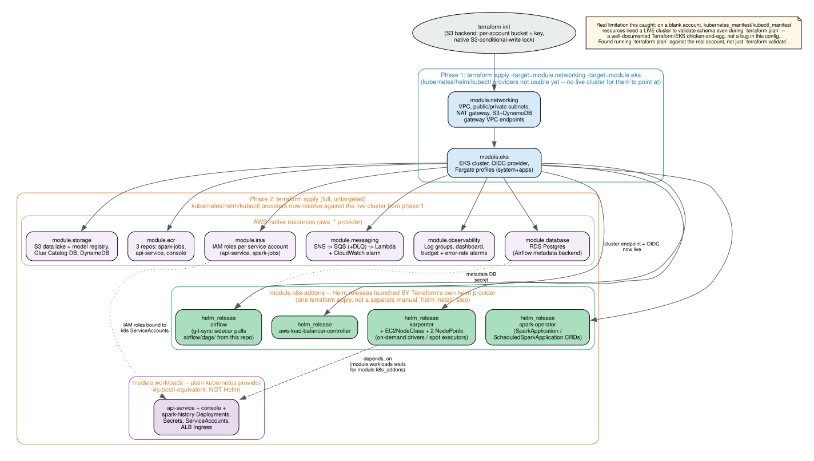

# Infrastructure — Terraform Implementation

This document is about the Terraform implementation itself (module structure, state management, apply sequencing, cost controls embedded in the code) — distinct from the other `docs/architecture/*.md` files, which describe *what* the system does. See `infra/terraform/README.md` for the exact deployment commands.

## Module structure

```
infra/terraform/
  versions.tf / providers.tf / variables.tf / main.tf / outputs.tf   (root)
  modules/
    networking/    VPC, public/private subnets, single NAT gateway, S3+DynamoDB gateway endpoints
    eks/            EKS cluster, OIDC provider (for IRSA), Fargate profile for steady lightweight workloads
    storage/        S3 data lake + model registry, Glue Catalog database, DynamoDB customer_scores
    ecr/             3 repositories (spark-jobs, api-service, console), immutable tags, untagged-image expiry
    irsa/            Least-privilege IAM roles per Kubernetes service account (not a shared node role)
    messaging/      S3->SNS->SQS->Lambda trigger chain, WITH a dead-letter queue + alarm
    observability/  Log groups with explicit retention, a 4-pillar dashboard, budget alarm, error-rate alarm
    k8s-addons/     Helm releases (ALB controller, Karpenter, Spark Operator, Airflow) + Karpenter NodePools
```

Each module is self-contained (own `variables.tf`/`outputs.tf`), wired together only in the root `main.tf` — no module reaches into another module's internals directly.

## State management

**Remote S3 backend**, not local state — set up once via:
```
aws s3api create-bucket ... churn-fde-sandbox-tfstate-<account-id>
aws s3api put-bucket-versioning ... Status=Enabled
aws s3api put-bucket-encryption ... AES256
aws s3api put-public-access-block ... (all four blocks true)
```
then `terraform init -backend-config="bucket=..." -backend-config="key=churn-fde/sandbox/terraform.tfstate" -backend-config="use_lockfile=true"`.

**Why `use_lockfile=true` instead of a separate DynamoDB lock table**: Terraform 1.10+ supports native S3-conditional-write locking, which is simpler and removes an entire extra resource (and its own IAM permissions) compared to the older DynamoDB-lock-table pattern, while providing the same guarantee — two concurrent `apply` runs can't corrupt each other's state.

**Versioning is enabled on the state bucket** specifically so a bad `apply` can be recovered from a previous state version, not just protected against concurrent writes.

**Backend config is intentionally NOT hardcoded** in `versions.tf` (bucket/key/region are supplied via `-backend-config` flags at init time) — this is what lets the identical Terraform code target both the personal sandbox and the official Localytics account later with a fresh `terraform init` pointing at a different bucket, no code changes needed.

## Two-phase apply (required, not optional)

```
terraform apply -target=module.networking -target=module.eks   # phase 1
terraform apply                                                  # phase 2
```



One tool, one state file, two ordered passes — not "Terraform provisions AWS, then a separate Helm step launches Kubernetes stuff." Phase 2's Helm releases (`module.k8s-addons`: the ALB controller, Karpenter, the Spark Operator, Airflow) are themselves `helm_release` resources managed by Terraform's own `helm` provider, applied in the same untargeted `terraform apply` as every other AWS-native resource — Helm is a provider Terraform drives, not a separate tool a human runs afterward. `module.workloads` (the application Deployments/Service/Ingress) goes through the plain `kubernetes` provider instead of Helm, since those are this project's own manifests, not a third-party chart — both still land in the same phase-2 apply, with an explicit `depends_on = [module.k8s_addons]` since the app pods need Karpenter's NodePools and the Fargate profile to actually exist first.

The `kubernetes`, `helm`, and `kubectl` providers are configured against `module.eks`'s outputs. On a blank account those outputs don't exist yet, and the `kubectl_manifest`/`kubernetes_manifest` resources specifically need a *live* cluster to validate schema even during `plan` — a well-documented Terraform/EKS limitation, not a bug in this config. This was caught by actually running `terraform plan` against the real sandbox account, not just `terraform validate` (full story in the commit history and `docs/architecture/01-data-platform.md`'s Karpenter section).

## Cost controls actually embedded in the code (not just documented intentions)

| Control | Where |
|---|---|
| Single NAT gateway, not one per AZ | `modules/networking` |
| S3 + DynamoDB **gateway VPC endpoints** (free) routing most traffic around the NAT entirely | `modules/networking` |
| Fargate (pay-per-pod) for steady services instead of a static EC2 node group | `modules/eks` |
| Karpenter provisions EC2 **only** for Spark jobs, on-demand driver / spot executor, scales to zero when idle | `modules/k8s-addons` |
| DynamoDB `PAY_PER_REQUEST` (bursty, unpredictable access pattern) instead of provisioned throughput | `modules/storage` |
| ECR untagged-image expiry after 7 days | `modules/ecr` |
| CloudWatch Log Group retention explicit (14 days default) — CloudWatch's own default is never-expire | `modules/observability` |
| AWS Budget alarm codified in Terraform (was a console click-ops step originally) | `modules/observability` |

## IRSA — least privilege per workload, not a shared role

Each Kubernetes service account that needs AWS access gets its own IAM role via OIDC federation, scoped to the specific resource ARNs it needs (`modules/irsa`):
- `api-service`: read model registry, read/write `customer_scores`, append-only to the Bronze S3 prefix
- `spark-jobs`: read/write the data lake bucket, write model registry, Glue Catalog access, write `customer_scores`

Neither role can do what the other doesn't need — a compromised API pod can't rewrite Gold tables, and a compromised Spark job can't touch the DynamoDB write path meant for the batch scoring job specifically... (actually spark-jobs does write DynamoDB — see the module for the exact statement — the point is each grant is deliberate, not "EKS node role can do everything").

## Reliability: the dead-letter queue

`modules/messaging` includes a DLQ on the `bronze-data-arrived` queue with a `maxReceiveCount` of 3 and a CloudWatch alarm on it — an earlier principal-engineer review of this design explicitly flagged the *absence* of this as a gap ("no documented recovery path if the Lambda->Airflow call failed"). A message that fails 3 times lands in the DLQ and pages instead of vanishing silently.

## What Terraform does NOT create

- The actual `SparkApplication`/`ScheduledSparkApplication` custom resources for Silver/Gold/Compaction — those are created at runtime by Airflow's `SparkKubernetesOperator` (medallion_pipeline_dag) and the Spark Operator's own scheduler (compaction), not by Terraform. Terraform installs the Spark Operator controller (the CRD definitions + webhook); individual job submissions are a runtime concern.
- The `airflow/dags/` contents themselves — Airflow's `git-sync` sidecar (configured in `modules/k8s-addons`'s `helm_release.airflow`) pulls those directly from this repo, so DAG changes don't require a Terraform apply.
