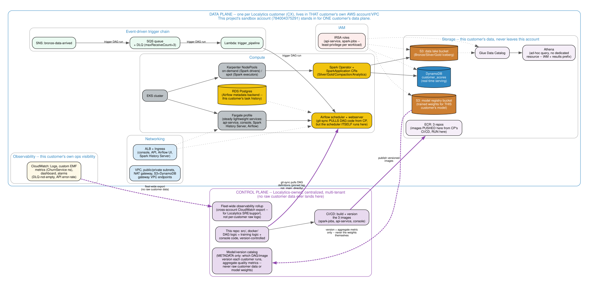

# Control Plane / Data Plane — Productizing This Beyond One Customer

Everything else in `docs/architecture/` describes what's actually deployed: one AWS account (`784004375291`), one customer's worth of data, one instance of every component. This document is different in kind — it's a **hypothetical**, not a description of what's built: if Localytics shipped this as a real product across many customers, how would it split between what Localytics centrally owns and what runs inside each customer's own environment? This sandbox account is a stand-in for **one customer's data plane**, not evidence that multi-tenancy exists today.

This is the exact split a Forward Deployment Engineer role lives in day to day, so it's worth being able to draw and defend precisely — not just gesture at "Localytics has a control plane and customers have data planes."

## The diagram

## The rule used to draw the line

**Data Plane (per customer, runs in that customer's own AWS account)**: anything that touches raw customer event data, or does compute on it. **Control Plane (Localytics, centralized)**: anything that only needs *code*, *metadata*, or *aggregates* — never a raw customer record.

Every real AWS/K8s resource this project actually provisions, placed explicitly:

| Component | Side | Why |
|---|---|---|
| VPC, subnets, NAT, S3+DynamoDB gateway endpoints | DP | Customer-account networking |
| EKS cluster, Fargate profile, Karpenter NodePools (on-demand driver / spot executor) | DP | Compute over that customer's own data |
| Airflow scheduler + webserver + RDS Postgres backend | DP | See "Airflow scheduler" below — a deliberate call, not an obvious one |
| Spark Operator + `SparkApplication` CRs (Silver/Gold/Compaction/Analytics) | DP | Executes against that customer's Bronze/Silver/Gold |
| S3 data lake bucket (Bronze/Silver/Gold Iceberg) | DP | Raw customer events |
| S3 model registry bucket (trained weights) | DP | See "Model artifacts vs. training code" below |
| Glue Data Catalog, Athena | DP | Query surface over that customer's own tables |
| DynamoDB `customer_scores` | DP | That customer's live serving layer |
| SNS `bronze-data-arrived`, SQS queue + DLQ, Lambda `trigger_pipeline` | DP | Operates on that customer's own Bronze writes |
| CloudWatch Logs, `ChurnService`-namespace metrics, dashboard, DLQ/error-rate alarms | DP (with a CP rollup — see "Observability" below) | Per-customer ops visibility first |
| ECR (3 repos) | DP | Images must be pullable by that customer's own EKS with no cross-account image-pull complexity |
| IRSA roles (`api-service`, `spark-jobs`) | DP | Scoped to that customer's account, by construction |
| ALB + Ingress | DP | Customer-account-local entry point |
| This repo's code (`src/`, `docker/`, DAG definitions) | CP | Product logic, versioned once, distributed to every customer |
| CI/CD image build/publish pipeline | CP | Builds once, pushes into every customer's own DP-side ECR |
| A lightweight model/version catalog (which DAG/image version each customer runs, aggregate quality metrics) | CP | Metadata only — never raw data or model weights |
| Fleet-wide observability rollup | CP | Cross-account CloudWatch export for Localytics SRE/support, not raw per-customer logs |

## Three boundary calls a principal engineer would immediately push on

**"Does the Airflow scheduler run in CP or DP?"** DP. The scheduler needs low-latency, same-VPC access to the customer's own EKS API and Spark cluster — routing every task-scheduling decision through a cross-account hop to a centralized CP scheduler adds latency, creates a shared blast radius across every customer sharing that scheduler, and quietly defeats the point of having a data plane at all (task logs and metadata routinely contain customer-identifying details). What Localytics centrally owns is the DAG *code* each customer's `git-sync` sidecar pulls in — not its execution.

**"If DAG code is centrally managed but executes in each customer's DP, how do you avoid a customer silently drifting onto stale code, or breaking on an unreviewed push?"** `git-sync` is pinned to a specific tag/branch per customer, not `main` directly — a version bump is a deliberate, reviewable change per customer (or per rollout cohort), not an automatic global push. The CP-side catalog exists specifically to answer "which customers are on which version" without needing to reach into any customer's account to find out.

**"Where do trained model weights actually live?"** In the customer's own S3 model-registry bucket, in DP — a model trained on Customer A's behavioral data must never leave Customer A's account, full stop. The *code* that produces that model (`src/modeling/train.py`, `select_as_of`, the XGBoost training logic) is centrally versioned in CP. Only non-sensitive metadata (which version trained it, when, aggregate PR-AUC) rolls up to the CP catalog — the dashed edges in the diagram, deliberately never the weights themselves.

## Observability: the one component that genuinely spans both

Everything in `05-observability.md` — Logs, the `ChurnService` custom metrics, the dashboard, the alarms — exists first and foremost as **that customer's own** operational visibility (their support team, their on-call, their dashboard). But a subset of it also needs to reach Localytics centrally, or there's no way to run fleet-wide SRE/support without individually logging into every customer's account. That's the `ROLLUP` node in the diagram: a cross-account CloudWatch export of aggregate health signals (error rates, DLQ depth, job failure counts) — explicitly **not** raw log lines, which could contain customer data.

## What this document is not claiming

This sandbox deployment is single-tenant, full stop — there is no multi-customer isolation being exercised here, no cross-account trust actually configured, no real CI/CD publishing pipeline. This is a design document answering "how would this productize," written because being able to reason about it precisely — not just as a nice box diagram — is exactly the kind of judgment a Forward Deployment Engineer role requires, and it's dishonest to present it as anything more than that.
