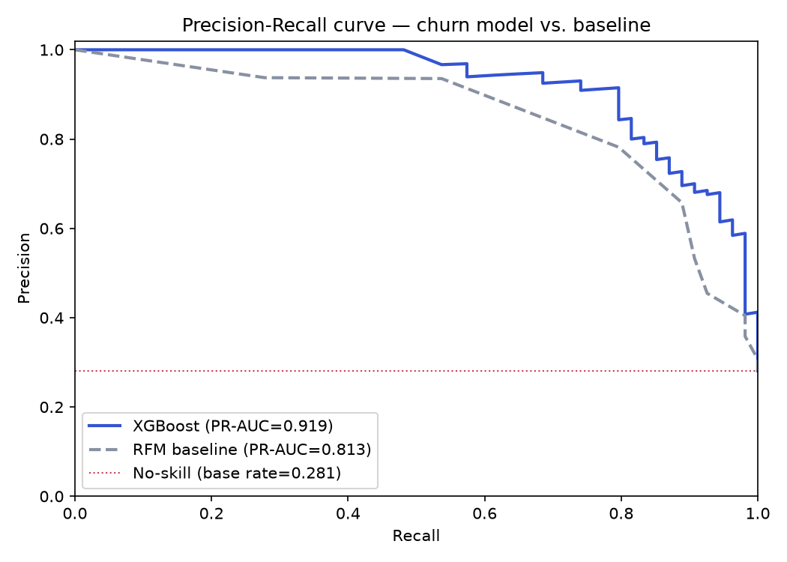

# Evaluation Metrics

## Why not accuracy

With a ~25% churn base rate (our synthetic dataset's target — see [modeling.md](modeling.md)), a model that predicts "nobody churns" scores 75% accuracy while being completely useless. Every metric below is chosen for imbalanced classification, not generic accuracy.

## The cost asymmetry driving the design

Missing a real churner (false negative) loses that customer with no chance to intervene — genuinely costly. Flagging a non-churner (false positive) costs one wasted campaign send/discount — annoying and wasteful, but far cheaper than losing the customer. **FN >> FP in cost**, so metrics lean toward recall, not precision/accuracy — but not without a floor, or marketing ends up contacting the entire customer base.

## Metrics reported

| Metric | Purpose |
|---|---|
| **PR-AUC** (average precision) | Headline ranking-quality metric; robust under imbalance, unlike ROC-AUC which gets optimistic/misleading when the negative class dominates |
| **Recall @ fixed precision** | "At an acceptable waste rate, how many real churners do we still catch?" — the question marketing would actually ask |
| **Top-decile capture / lift** | Of the riskiest 10% targeted, what fraction of actual churners is caught vs. random targeting — matches the real usage pattern: audience selection is a ranked list, not a uniform yes/no classifier |
| **F2 score** | Recall weighted 2x precision, reflecting the FN-costlier-than-FP asymmetry; used to pick the operating threshold |
| **Calibration (Brier score)** | Secondary — checks that a "73% risk" score is trustworthy, not just a good rank |

## Threshold selection

**Capacity-based**, not an arbitrary 0.5 cutoff: the threshold is set to target the **top ~15%** of customers, matching a realistic campaign budget — a concrete "who gets contacted" answer for marketing, not just a statistically-optimal-but-abstract number. F2/recall/precision are reported at that operating point.

## Protocol

Stratified **70/15/15 train/val/test** split on the label (churn rate preserved in each split). Validation set tunes the threshold; test set reports final numbers and is reused (same set, sliced by the synthetic segment fields) for the fairness check — no separate sampling for that.

## Reporting

Baseline (RFM quintile rule, see [modeling.md](modeling.md)) vs. XGBoost model, side-by-side on every metric above, plus a cumulative gains/lift chart — visually answers "random targeting vs. our model" for a non-technical audience, surfaced in the [reviewer console](architecture/06-reviewer-console.md).

## Results (real run — full 1,280-customer population, held-out test set, n=192)

Produced by `scripts/run_training_pipeline.py`; raw output in `reports/metrics.json`. Training now reads the real, live-accumulating Silver Iceberg table (`DATA_LAKE_BUCKET` set) rather than regenerating a synthetic-only snapshot, so this includes the real 80-customer sample (`data/events.json`) alongside the 1,200-customer synthetic bootstrap population — both flow through the same Bronze→Silver pipeline. See [03-orchestration.md](architecture/03-orchestration.md) for `select_as_of`, the guardrail that decides whether a given run can safely use a fresher `as_of` than this fixed historical one.

| Metric | Baseline (RFM quintile rule) | XGBoost |
|---|---|---|
| PR-AUC | 0.813 | **0.919** |
| Recall @ precision ≥ 40% | 0.981 | **1.000** |
| Top-decile capture | 0.333 | **0.352** |
| F2 @ capacity threshold (top 15%) | 0.571 | **0.592** |
| Precision @ capacity threshold | 0.966 | **1.000** |
| Recall @ capacity threshold | 0.519 | **0.537** |
| Brier score | 0.178 | **0.079** |

The curve above is what the PR-AUC number in the table actually summarizes — precision vs. recall swept across *every* possible threshold, not just the 15% capacity cutoff. XGBoost's curve sits above the baseline's almost everywhere, and both sit well above the red no-skill line (a model with zero ranking ability would track the population's base churn rate, ~28%, flat across every recall level). Raw curve points in `reports/pr_curve.json`.

XGBoost beats the baseline on every metric. Both models reach near-full recall if precision is allowed to drop to 40%, which isn't surprising given the churn base rate (28.1%) isn't extreme. The metrics that actually reflect the operating constraint (fixed 15% campaign capacity) — precision/recall/F2 at that threshold, plus PR-AUC and calibration — show a clear, consistent improvement.

**A note on exact decimals**: none of the three deployed images pin `xgboost`/`scikit-learn`/`numpy`/`pandas` versions (see `SUBMISSION.md`), so a training run in the deployed container can produce slightly different decimal metrics than a local run against the same seed and the same data — both real, both showing the same consistent XGBoost-beats-baseline story. The numbers above are from one specific, reproducible run (historical `as_of`, matching what `training_dag` currently has deployed).

**A real bug found and fixed while producing these numbers**: the baseline's combined RFM score only takes ~13 distinct integer values (range 3-15). A naive "select everyone scoring ≥ the 85th-percentile threshold" over-selected to ~30% of customers instead of the intended 15%, because so many customers tied at the threshold value. Fixed by selecting exactly the top-N by rank (`capacity_selection_mask` in `src/modeling/evaluate.py`) regardless of ties, so the baseline and XGBoost are compared at a genuinely fixed, equal budget — otherwise the baseline's numbers would have looked artificially strong from simply contacting twice as many customers.
